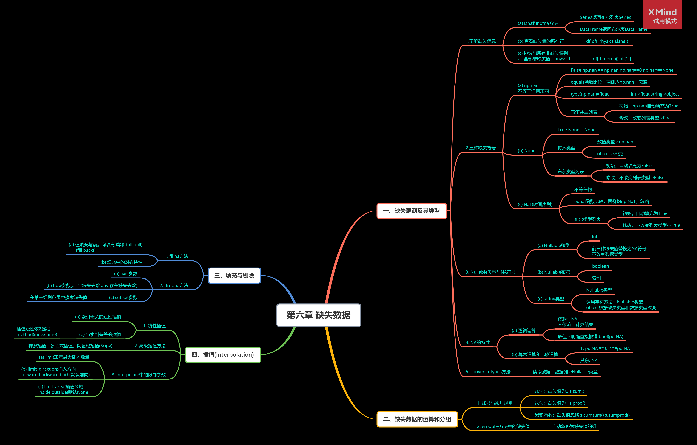
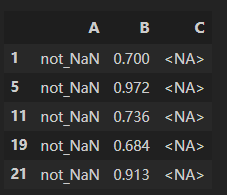
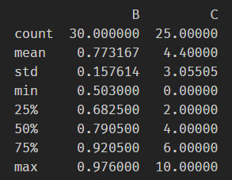
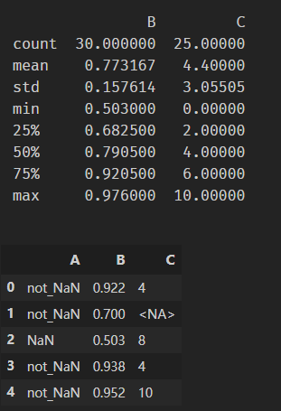
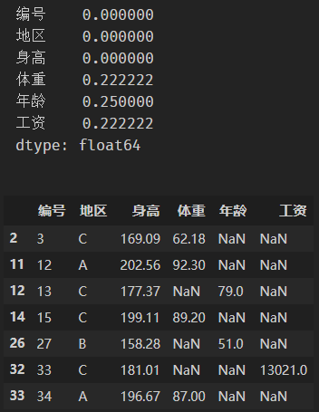

# 第六章 缺失数据

## 第六章总结



## 1.问题

**问题一：如何删除缺失值占比超过25%的列？**

使用isna方法计算出缺失值占比超过25%的列。

然后删除。

代码示例：

```python
df_test = pd.read_csv('data/table_missing.csv')
print(df_test.size)
num = df_test.shape[0]
columns = df_test.isna().sum()/num>0.25
del_columns =  (columns==False)
print(del_columns)
print(df_test.loc[:,del_columns.values].head())
```

```tex
315
School      True
Class       True
ID          True
Gender      True
Address     True
Height      True
Weight     False
Math        True
Physics     True
dtype: bool
  School Class      ID Gender   Address  Height  Math Physics
0    S_1   C_1     NaN      M  street_1     173  34.0      A+
1    S_1   C_1     NaN      F  street_2     192  32.5      B+
2    S_1   C_1  1103.0      M  street_2     186  87.2      B+
3    S_1   NaN     NaN      F  street_2     167  80.4     NaN
4    S_1   C_1  1105.0    NaN  street_4     159  84.8      A-
```

**问题二：什么是Nullable类型，为什么要引入这个设计？**

Nullable是pandas在升级至1.0后新引入的一种缺失值类型，其符号统一为NA，避免了老版本中np.nan、None、NaT复杂且不统一的语法关系，让缺失值的表示和应用更简单。

**问题三：对于一份有缺失值的数据，可以采用哪些策略或方法深化对它的了解？**

可以1）使用isna和notna函数查看缺失值所在的行和列；2）使用fillna方法填充数据；3）使用线性插值的方法填充；等加深对该缺失值的数据的了解。

## 2.练习

**【练习一】现有一份虚拟数据集，列类型分别为string/浮点/整型，请解决如下问题：**

**(a) 请以列类型读入数据，并选出C为缺失值的行。**

```python
df = pd.read_csv('data/Missing_data_one.csv').convert_dtypes()
df[df['C'].isna()]
```



**(b) 现需要将A中的部分单元转为缺失值，单元格中的最小转换概率为25%，且概率大小与所在行B列单元的值成正比。**

方法一：

```python
df = pd.read_csv('data/Missing_data_one.csv').convert_dtypes()
print(df.describe())
```



可以看到B的min是0.503，最大值为0.976。

第一种方法就是直接把B的值归一化，然后小于0.25的值转换为np.nan。

```python
import numpy as np
df = pd.read_csv('data/Missing_data_one.csv').convert_dtypes()
print(df.describe())
total_b = df['B'].sum()
min_b = df['B'].min()
max_b = df['B'].max()
df['A'] = pd.Series(list(zip(df['A'].values,df['B'].values))).apply(lambda x:x[0] if (x[1]-min_b)/(max_b-min_b)>0.25 else np.nan)
df.head()
```



方法二：采用随机数，要使得概率正比于B列，采用系数为每个B列归一化后的值，这样一来，0<=系数<=1,当随机数*系数>0.25时，A的单位格转换为缺失值。可以保证转换率>0.25。

```python
import numpy as np
df = pd.read_csv('data/Missing_data_one.csv').convert_dtypes()
print(df.describe())
total_b = df['B'].sum()
min_b = df['B'].min()
max_b = df['B'].max()
df['A'] = pd.Series(list(zip(df['A'].values,df['B'].values))).apply(lambda x:x[0] if np.random.rand()>0.25*(x[1]-min_b)/(max_b-min_b) else np.nan)
df.head()
```


**【练习二】 现有一份缺失的数据集，记录了36个人来自的地区、身高、体重、年龄和工资，请解决如下问题：**

**（a）统计各列缺失的比例并选出在后三列中至少有两个非缺失值的行。**

```python
df = pd.read_csv('data/Missing_data_two.csv')
num = df.shape[0]
print(df.isna().sum()/num)
cut_columns = df.columns[-3:].values
df[df[cut_columns].isna().sum(1)>=2]
```



**（b）请结合身高列和地区列中的数据，对体重进行合理插值。**

先用方法分组，然后每组按身高排列后对体重插值。

```python
df_copy = df.copy()
for name, group in df_copy.groupby('地区'):
    df_copy.loc[group.index, '体重'] = group[['身高','体重']].sort_values(by='身高').interpolate()['体重']
# 小数取两位
df_copy['体重'] = df_copy['体重'].round(decimals=2)
df_copy.head()
```


